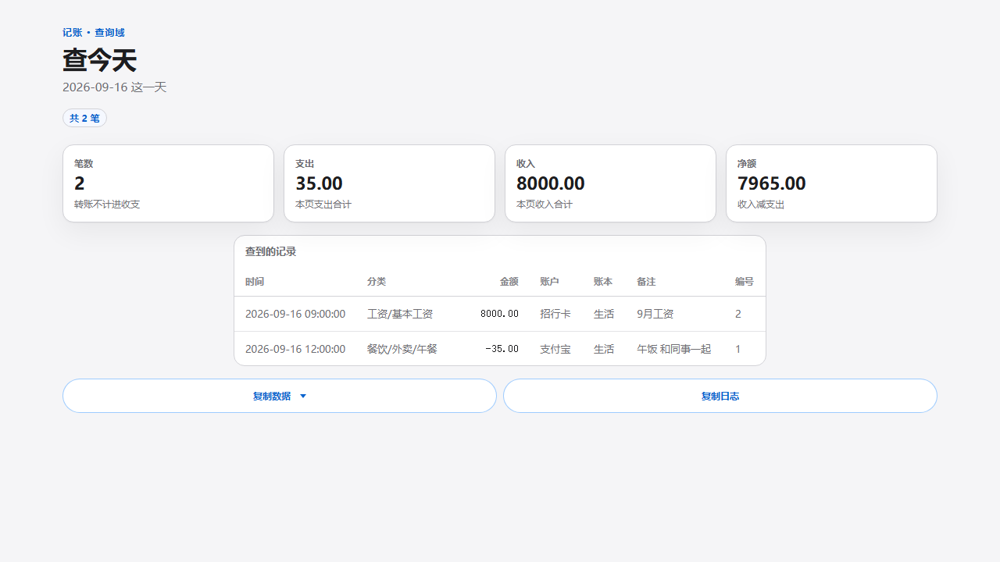
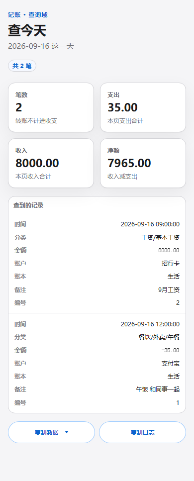
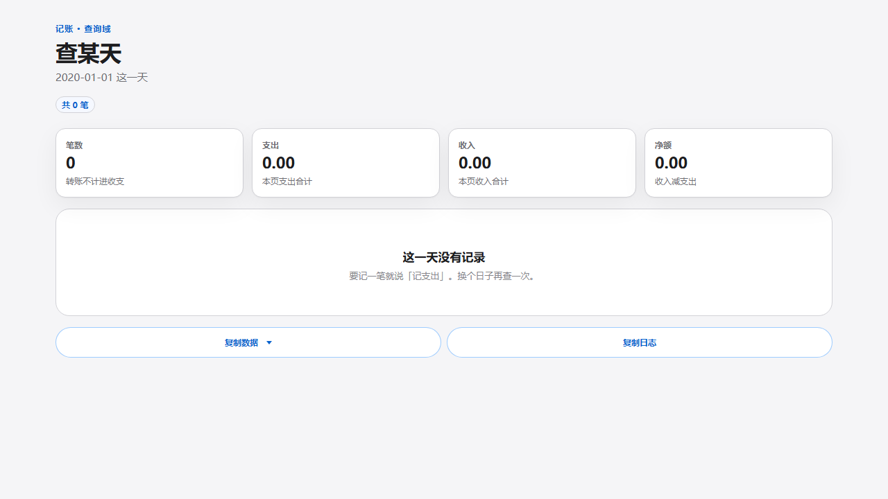
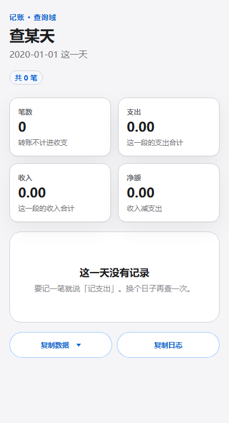
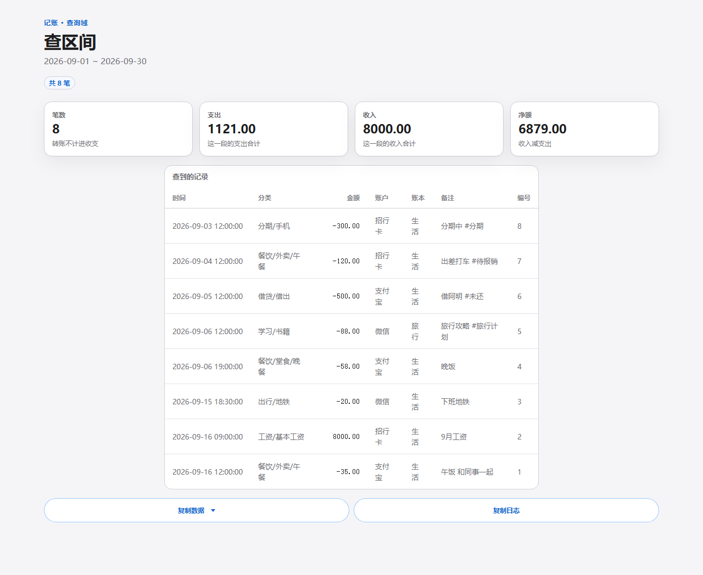
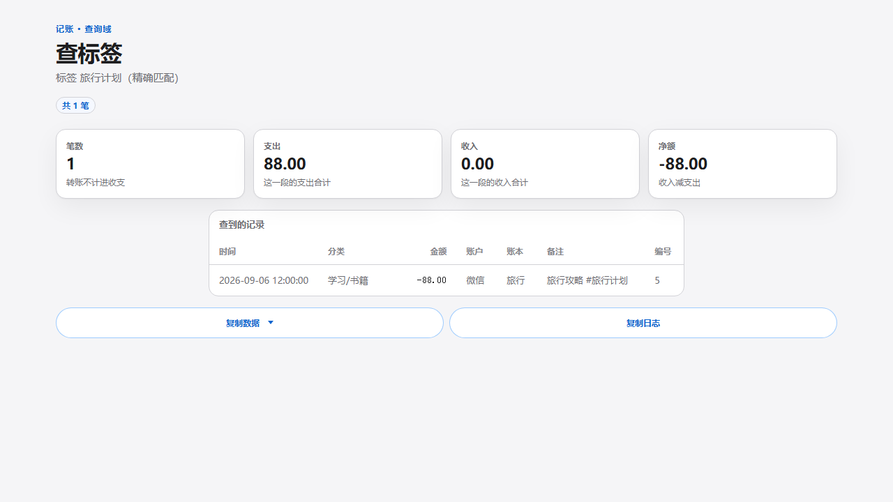
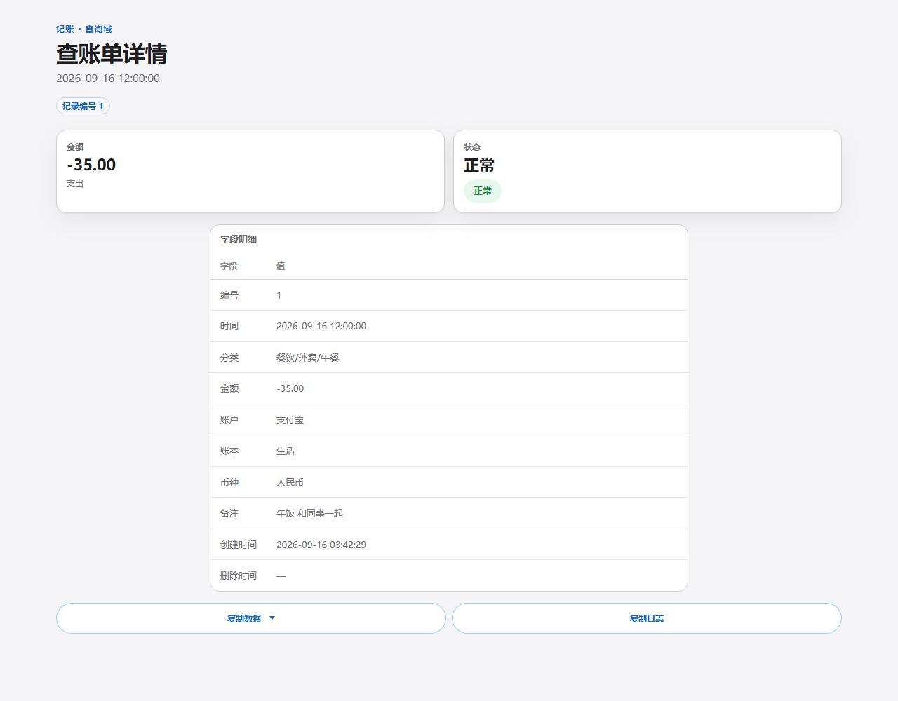
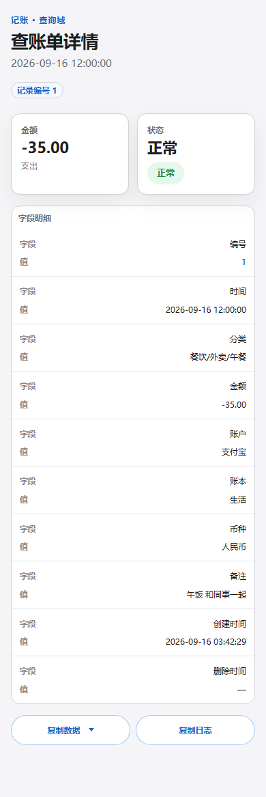
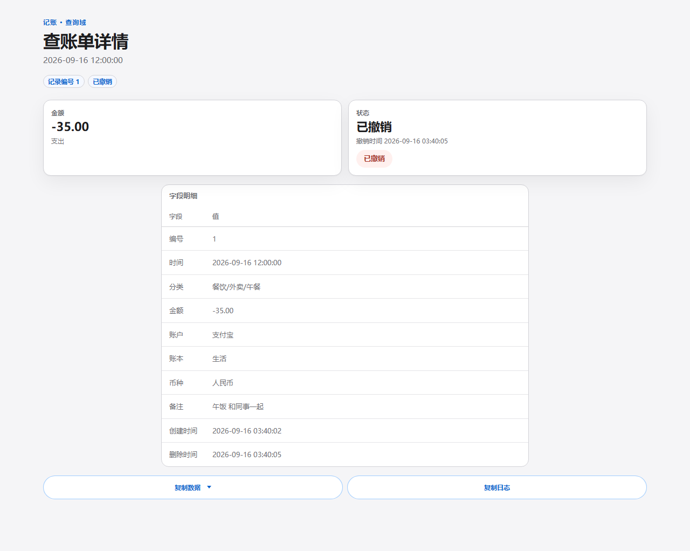

# 查询页双端截图证据（验收链第 ③ 条；正式的墙走官方口径见下）

> 本件是**双端截图**（验收链第 ③ 条：截图＋逐页结论），不是正式的视觉验收墙。
> 正式的墙（第 ④ 条：iframe 真渲染双墙＋总索引＋逐格缺陷清单）走官方口径
> `docs/agents/视觉验收墙.md`：生成器 `docs/skills/skill-bill/t403-验收墙.mjs`、
> 清单 `t403-manifest.json`、墙页 `.scratch/t403-query-wall/`（18 格，他席已出，见
> `docs/skills/skill-bill/t403-视觉验收墙.md`，当前最低格 82 → D1／D2 补丁落地后复量）。
> 本件 7 页样张与 9 张截图仍是有效的第 ③ 条证据，打磨改动见 §三。

## 一 验收物（页 → 看什么 → 桌面 → 手机）

| 页 | 看什么 | 桌面 1280 | 手机 390 |
|---|---|---|---|
| 查今天 | 胶囊`共 2 笔`、笔数裸数、`本页…合计` | [样张](验收墙/p1-today.html)  |  |
| 查某天空态 | 空态句＋两句 hint、无 `；` | [样张](验收墙/p2-empty.html)  |  |
| 查区间 | 8 行表、KPI 四格 | [样张](验收墙/p3-range.html)  | 同行卡机制（见查今天手机） |
| 搜备注 | 单行命中 | [样张](验收墙/p4-search.html)  | 同上 |
| 查最近 | 倒序 5 笔 | [样张](验收墙/p5-recent.html) | 同上 |
| 查账单详情 | 胶囊`记录编号 1`、表题`字段明细`、无第三遍正常 | [样张](验收墙/p6-detail.html)  |  |
| 详情已撤销 | 胶囊`已撤销`＋danger 徽 | [样张](验收墙/p7-detail-deleted.html)  | 同上机制 |

## 二 vision 打分（本件口径，非正式墙打分）

布局 20＋文案零冗余 25＋卡表可读 20＋空态引导 10＋移动适配 15＋操作可发现 10＝100/100。
正式墙用另一套量表（层级／留白对齐／无符号串／无内部话／本端适配／对比按钮），
`t403-视觉验收墙.md` 当前 18 格均值 90.0／92.5、最低格 82（D1 表窄／D2 手机详情冗余），
待补丁落地复量过 90 线——那份才是签字依据。

## 三 改了什么（5 条）／没动什么

改：结果胶囊行（副标题去 `·`）／笔数去单位／`这一段`→`本页`合计／正常态删第三遍／表题改名／hint 去 `；`。
没动：复制日志 `｜·`（机器载荷原文，判据冻结，只在按钮属性里）、H1／徽章／KPI 格数／空态四句／金额半角负号（与载荷同字）。
手机端：与 HELP 同源（同一套 blocks 断点：KPI 2×2、表格转行卡化），无横向溢出。

## 四 请你确认

回一个字「过」：我关 #417、地图推 100%。有刺眼处：指哪张图哪一行，我改完重截再审。
